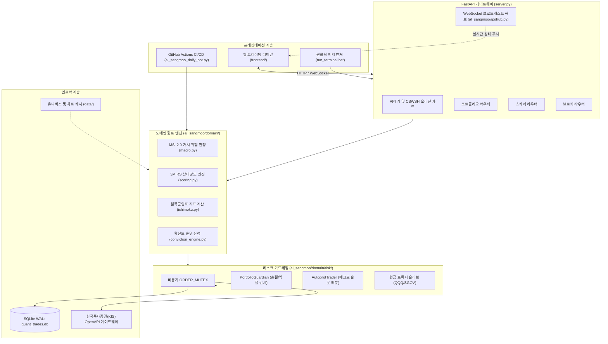

# R-Quant System: 알상무 실전 퀀트 트레이딩 시스템

[English](README.md) | [한국어](README.ko.md)


미국 주식 시장을 대상으로 설계된 실전형 알고리즘 스윙 트레이딩 및 위험 관리 시스템입니다. 17년 경력의 전직 프랍 트레이더 알상무(Alex Oh)가 유튜브에서 공유한 실전 매매 철학(일목균형표, 3개월 상대강도, 거시 위험 지표, 분할 매수 및 칼손절 원칙)을 코드로 구현하여, 인간의 감정과 뇌동매매를 배제하고 기계적으로 포트폴리오를 운용하도록 구축되었습니다.

---

## 💡 30초 핵심 요약 (TL;DR)

1. **이 프로젝트는 무엇인가요?**  
   미국 나스닥/S&P 주요 주도주를 매일 분석하여 상승 확률이 높은 종목을 골라내고, 정해진 룰에 따라 자동 매수 및 손절(-7% EOD / -10% 비상 손절), 익절(+18% 트레일링)을 수행하는 개인 실전용 퀀트 스윙 매매 시스템입니다.

2. **왜 이름이 '알상무'인가요?**  
   17년 동안 시장에서 활동해온 트레이더 '알상무(Alex Oh)'의 50회차 유튜브 라이브 강의 속 매매 룰셋을 음성 전사(VTT) 및 NLP 분석으로 역설계하여, 그의 투자 원칙을 24시간 대신 수행하는 **'디지털 트윈'**을 만들자는 목표로 시작되었기 때문입니다.

3. **지금 바로 무엇을 실행해 볼 수 있나요?**  
   Windows 환경에서 `run_terminal.bat`을 더블클릭하거나 터미널에서 `python server.py`를 실행하면 로컬 서버(포트 8000)가 열리며, 웹 브라우저를 통해 실시간 트레이딩 대시보드를 직접 사용할 수 있습니다.

4. **폴더 구조는 왜 이렇게 나뉘어 있나요?**  
   - `al_sangmoo/`: 핵심 매매 알고리즘과 백엔드 서버 로직
   - `frontend/`: 브라우저에서 보는 실시간 웹 트레이딩 대시보드
   - `archive/`: 프로젝트 초기에 수집했던 50회차 유튜브 자막 및 연구 데이터
   - `docs/`: 시스템 설계 명세서 및 투자설명서(Prospectus) 문서
   - `research_and_backtests/`: SEC 공시 데이터 분석 및 과거 수익률 백테스터

---

## 1. 프로젝트 탄생 배경과 '알상무'의 기원

### 트레이더 알상무(Alex Oh)의 실전 철학
알상무는 월스트리트 프랍 트레이딩과 헤지펀드에서 17년 이상 퀀트 운용을 총괄해온 베테랑 트레이더입니다. 그는 개인 투자자가 시장에서 지속적으로 실패하는 가장 큰 원인이 "감정에 휘둘린 추격 매수, 손절 지연, 원칙 없는 물타기"에 있다고 지적하며, 시장(SPY)보다 강한 주도주를 골라 기계적인 룰셋으로 매매하는 원칙을 설파했습니다.

### 프로젝트의 출발점: '알상무 디지털 트윈'
라이브 방송의 음성 지식은 시간이 지나면 휘발되기 쉽습니다. 이에 유튜브 50회차 이상의 라이브 음성 전사(VTT) 데이터를 수집하고 텍스트 마이닝을 거쳐, **알상무의 매매 원칙을 인간의 감정적 개입 없이 24시간 작동하는 코드로 구현하고자** 본 프로젝트가 시작되었습니다.

### 왜 'R-Quant System'인가?
- **R (알)**: 알상무의 핵심 독트린과 정체성을 상징합니다.
- **R (Relative Strength)**: 주도주를 선별하는 핵심 기준인 3개월 상대강도를 의미합니다.
- **R (Rule-based Robustness)**: 사전 정의된 규칙에 따라 감정 없이 실행되는 시스템의 규율을 뜻합니다.

---

## 2. 프로젝트 5단계 발전 과정

단순한 유튜브 자막 분석 스크립트에서 시작하여, 웹 터미널과 증권사 연동을 갖춘 종합 트레이딩 시스템으로 발전해 왔습니다.

```
[Phase 1: 기원 및 지식 증류]   -->  [Phase 2: 포워드 트래커]   -->  [Phase 3: 퀀트 SSOT 엔진]   -->  [Phase 4: 웹 터미널 구축]   -->  [Phase 5: 검증 및 하드닝]
50회차 유튜브 음성 전사 NLP       GitHub Actions 자동화 봇        도메인 퀀트/리스크 가드레일        FastAPI + WebSocket 웹터미널      SEC N-PORT 헤지펀드 지분 추적
투자 원칙 역설계 (archive/)      수익률 자가검증 (trade_history)   주문 동시성 락 (ORDER_MUTEX)     한국투자증권(KIS) 실계좌 연동     무편향 PIT 백테스터, 50여 개 E2E
```

1. **Phase 1 (기원 및 지식 증류)**: 유튜브 50회차 라이브 방송 자막(VTT)을 수집하여 일목균형표(구름대/호전), 3개월 RS 모멘텀, 거시 위험 지표를 수식화하고 원천 자료를 `archive/`에 보존.
2. **Phase 2 (포워드 트래커)**: 매일 미국 장 마감 후 시장을 자동 스캔하고, 추천 종목의 사후 수익률을 누적 기록(`trade_history.csv`)하여 모델 유효성을 자가 검증.
3. **Phase 3 (퀀트 SSOT 엔진)**: 거시 지표, 종목 채점, 포지션 배분 모듈을 분리하고, 다중 주문 충돌을 방지하는 `ORDER_MUTEX`와 SQLite WAL DB를 구축.
4. **Phase 4 (웹 터미널 구축)**: FastAPI 비동기 백엔드와 실시간 WebSocket 허브, 한국투자증권(KIS) OpenAPI 연동 및 블룸버그 스타일 웹 트레이딩 대시보드(`frontend/`) 개발.
5. **Phase 5 (검증 및 하드닝)**: SEC Form N-PORT 기관 지분 공시 추적, 미래참조 편향 없는 PIT 백테스터, 보안·동시성·멱등성을 점검하는 50여 개 자동화 테스트 구축.

---

## 3. 핵심 퀀트 프레임워크 및 위험 관리 원칙

```
+-------------------------------------------------------------------------------+
|                            거시 위험 지표 (MSI 2.0)                           |
|        입력 지표: 미국 10년물 국채금리, 달러 인덱스, VIX, 하이일드 스프레드, SPY vs 200 SMA     |
+---------------------------------------+---------------------------------------+
                                        |
                 +----------------------+----------------------+
                 |                                             |
        [강세장: SPY >= 200 SMA]                       [약세장: SPY < 200 SMA]
        최대 3개 슬롯 운용 (34/33/33)                  최대 2개 슬롯 축소 (25/25)
                 |                                             |
                 +----------------------+----------------------+
                                        |
+---------------------------------------v---------------------------------------+
|                           종목 발굴 및 확신도 판정                            |
|   1. 3개월 상대강도(RS) 모멘텀 상위 주도주 선별                               |
|   2. 일목균형표: 주가 > 구름대, 전환선 > 기준선 골든크로스, 후행스팬 호전              |
|   3. SEC Form N-PORT 기관 지분 중복도 결합                                    |
+---------------------------------------+---------------------------------------+
                                        |
+---------------------------------------v---------------------------------------+
|                           체결 및 리스크 가드레일                             |
|   - 동시성 보호: 글로벌 비동기 ORDER_MUTEX 독점 체결                          |
|   - 손절선 (Dual Stop): 종가 기준 -7.0% Soft Stop / 장중 -10.0% 비상 Hard Stop |
|   - 익절선 (Trailing TP): +18.0% 도달 시 발동, 3.0x ATR 트레일링 바닥선 추종    |
|   - 미할당 자본: 현금 프록시 슬리브(Cash Proxy: QQQ / SGOV / BIL) 자동 파킹   |
+-------------------------------------------------------------------------------+
```

### 정량적 SSOT 매개변수
| 항목 | 설정값 | 상세 목적 |
| :--- | :--- | :--- |
| **최대 포트폴리오 슬롯 (강세)** | 3슬롯 (34% / 33% / 33%) | 최상위 주도주 3종목에 집중 분할 투자 |
| **최대 포트폴리오 슬롯 (약세)** | 2슬롯 (25% / 25%) | 시장 하락 국면 시 위험 노출도 축소 및 현금 비중 50% 강제 확보 |
| **종가 기준 손절 (EOD Stop)** | -7.0% | 장중 일시적 노이즈를 견디고 일봉 종가 마감 시 청산 |
| **비상 하드 손절 (Emergency Stop)** | -10.0% | 장중 급락 및 갭하락 발생 시 즉시 시장가 비상 탈출 |
| **트레일링 익절 (Trailing TP)** | +18.0% | 고수익 진입 시 활성화되며 3.0x ATR 기반으로 이익 보존 |
| **현금 프록시 슬리브** | QQQ / SGOV / BIL | 유휴 자금의 현금 드래그(Cash Drag)를 방지하며 안전 자산에 파킹 |
| **데이터베이스 영속성** | SQLite WAL Mode | 비동기 데몬 간의 읽기/쓰기 락 경합 제거 |

---

## 4. 시스템 아키텍처



---

## 5. 저장소 디렉터리 안내

```
r-quant-system/
|-- al_sangmoo/                 # 프로덕션 코어 파이썬 패키지 (매매 알고리즘, 리스크 가드레일, 브로커 게이트웨이)
|-- frontend/                   # 실시간 웹 트레이딩 대시보드 (HTML, CSS, JS, Canvas 차트)
|-- docs/                       # 시스템 설계서 및 투자설명서 문서 (prospectus, handoffs, archive)
|-- research_and_backtests/     # SEC Form N-PORT 기관 지분 파서 및 백테스터
|-- tests/                      # 핵심 기능 단위 테스트
|-- tools_and_tests/            # 50여 개 보안, 동시성, 멱등성, 퀀트 E2E 테스트 스위트
|-- data/                       # 차트 캐시 및 SQLite 데이터베이스
|-- daily_reports/              # 일일 퀀트 스캔 마크다운 리포트 아카이브
|-- archive/                    # 과거 연구 유산 (유튜브 50회차 자막 VTT 및 NLP 마크다운 문서)
|-- server.py                   # FastAPI 메인 백엔드 서버 진입점 (포트 8000)
|-- al_sangmoo_daily_bot.py     # 매일 자동 스캔 및 포워드 트래커 봇
|-- run_terminal.bat            # 윈도우 원클릭 표준 터미널 실행 스크립트
|-- 알상무_퀀트_터미널_실행.bat    # 한국어 콘솔 런처 (포트 자동 점유 해제 및 브라우저 기동)
|-- README.md                   # 메인 기술 문서 (영문)
`-- README.ko.md                # 메인 기술 문서 (한국어)
```

---

## 6. 설치 및 실행 방법

### 6.1 요구 환경
- Python 3.11 이상
- Git
- 모던 웹 브라우저 (Chrome, Edge, Firefox)

### 6.2 설치
```bash
# 저장소 복제
git clone https://github.com/DoDuekChill/r-quant-system.git
cd r-quant-system

# 가상환경 생성 및 활성화
python -m venv venv
# Windows:
.\venv\Scripts\activate
# Linux/macOS:
source venv/bin/activate

# 의존성 패키지 설치
pip install --upgrade pip
pip install -r requirements.txt
```

### 6.3 환경 변수 설정
`.env.example` 파일을 복사하여 `.env` 파일을 생성합니다:

```bash
cp .env.example .env
```

`.env` 파일에 모의투자 또는 실계좌 API 키를 입력합니다. **실제 인증 키가 포함된 `.env` 파일은 절대 깃에 커밋해서는 안 됩니다.**

```ini
# 운용 모드: 'paper' (모의투자) 또는 'live' (실계좌 자동매매)
ENVIRONMENT=paper

# 한국투자증권(KIS) OpenAPI 인증 정보 (더미 예시)
KIS_APP_KEY=your_kis_app_key_here
KIS_APP_SECRET=your_kis_app_secret_here
KIS_CANO=12345678
KIS_ACNT_PRDT_CD=01

# 시스템 보안
API_SECRET_KEY=your_random_secret_token_here
REQUIRE_AUTH=false

# 퀀트 엔진 리스크 파라미터
STOP_LOSS_PCT=0.07
EMERGENCY_STOP_LOSS_PCT=0.10
TAKE_PROFIT_PCT=0.18
```

### 6.4 플랫폼 실행

#### 방법 1: 원클릭 배치 런처 실행 (Windows)
`run_terminal.bat`을 실행합니다. 8000 포트 점유 프로세스를 정리하고 서버를 띄운 뒤 브라우저를 엽니다.

```cmd
run_terminal.bat
```

#### 방법 2: 수동 명령줄 실행
```bash
python server.py
```

서버 기동 후 브라우저에서 아래 주소로 접속합니다:
```
http://localhost:8000
```

---

## 7. 자동화 테스트 및 검증

```bash
# 퀀트 스코어링 및 거시 지표(MSI) 단위 테스트
pytest tools_and_tests/test_domain_quant.py -v

# 단일 진실 공급원(SSOT) 리스크 불변성 테스트
pytest tools_and_tests/test_risk_constants_ssot.py -v

# 손절선 및 트레일링 익절 로직 검증
pytest tools_and_tests/test_backtest_stop_ssot.py -v

# 네트워크 재시도 시 주문 멱등성 검증
pytest tools_and_tests/test_idempotent_kis_order.py -v
```

---

## 8. 보안 및 면책 조항

- **투자 권유 배제**: 본 소프트웨어는 개인적인 퀀트 연구 및 알고리즘 트레이딩 실습 목적으로 개발되었습니다. 모든 투자 판단과 책임은 사용자 본인에게 있습니다.
- **인증 정보 보호**: 증권사 API Key, 시크릿, 계좌번호는 로컬 `.env` 환경 변수로만 관리되어야 합니다. 저장소의 `.gitignore`는 모든 인증 및 토큰 파일을 엄격히 배제합니다.

---

## 9. 라이선스

본 프로젝트는 MIT 라이선스에 따라 배포됩니다. 자세한 사항은 [LICENSE](LICENSE)를 참조하시기 바랍니다.
