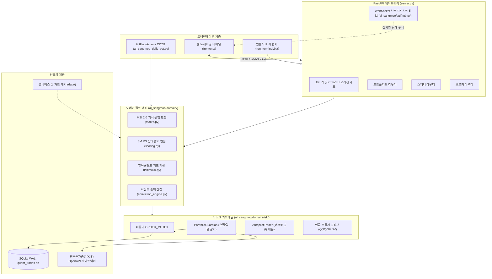

# R-Quant System: 알상무 기관급 퀀트 플랫폼

[English](README.md) | [한국어](README.ko.md)


미국 주식 시장을 대상으로 설계된 기관급 알고리즘 스윙 트레이딩 및 위험 관리 플랫폼입니다. 17년 경력의 전직 월스트리트/헤지펀드 퀀트 매니저 알상무(Alex Oh)의 실전 투자 원칙을 수학적·체계적 알고리즘으로 디지털화하였으며, 비동기 FastAPI 백엔드, SQLite WAL(Write-Ahead Logging) 단일 진실 공급원(SSOT) 영속성 계층, 실시간 WebSocket 브로드캐스트 허브, 한국투자증권(KIS) OpenAPI 증권사 게이트웨이, 고성능 블룸버그 스타일 웹 트레이딩 터미널로 구동됩니다.

---

## 1. 프로젝트 탄생 배경과 '알상무' 브랜딩의 기원

### '알상무(Alex Oh)'는 누구인가?
'알상무'는 월스트리트 프랍 트레이딩(Proprietary Trading)과 글로벌 헤지펀드에서 17년 이상 퀀트 운용 및 포트폴리오 매니징을 총괄해온 베테랑 트레이더 Alex Oh의 통칭입니다. 그는 감정적 추격 매수와 뇌동매매를 철저히 배제하고, 통계적 우위에 기반한 기계적 룰셋(Rule-based System)과 시장 주도주 모멘텀 스윙 전략을 유튜브 라이브 방송을 통해 대중에게 설파해 왔습니다.

### 프로젝트의 출발점: '알상무 디지털 트윈(Digital Twin)'
실전에서 검증된 17년의 정밀한 퀀트 노하우가 유튜브 라이브 방송의 휘발성 발언으로 흩어지는 한계를 극복하고자, 50회차 이상의 라이브 음성 전사(VTT) 데이터와 방송 텍스트를 전수 수집 및 NLP 마이닝하여 **알상무의 투자 뇌(Brain)와 매매 원칙을 인간의 편향 없이 24시간 작동하는 디지털 트윈 코드로 온전히 역설계(Reverse Engineering)**하는 작업에서 본 프로젝트가 시작되었습니다.

### 왜 'R-Quant System'인가?
- **R (알)**: 알상무의 핵심 독트린과 정체성을 상징합니다.
- **R (Relative Strength)**: 시장(SPY) 대비 초과 수익을 창출하는 주도주 판별의 알파원천인 3개월 상대강도를 의미합니다.
- **R (Rule-based & Robustness)**: 감정을 배제하고 사전 정의된 수학적 가드레일에 의해 통제되는 시스템의 견고함을 뜻합니다.

---

## 2. 프로젝트 5단계 상세 발전사 (History & Milestones)

초기 유튜브 영상 자막 스크랩 스크립트에서 시작하여, 현재의 풀스택 기관급 자동매매 플랫폼에 이르기까지 5단계의 아키텍처 진화를 거쳤습니다.

```
[Phase 1: 기원 및 지식 증류]   -->  [Phase 2: 포워드 트래커]   -->  [Phase 3: 퀀트 SSOT 엔진]   -->  [Phase 4: 풀스택 터미널]   -->  [Phase 5: C-2 기관화 및 결함 방어]
50회차 유튜브 음성 전사 NLP       GitHub Actions 자동화 봇        도메인 퀀트/리스크 가드레일        FastAPI + WebSocket 웹터미널      SEC N-PORT 헤지펀드 지분 추적
투자 독트린 역설계 (archive/)    수익률 자가검증 (trade_history)   주문 동시성 뮤텍스 (ORDER_MUTEX)   한국투자증권(KIS) 실계좌 연동     무편향 PIT 백테스터, 50여 개 E2E
```

### Phase 1: 기원 및 지식 증류 (Genesis & Knowledge Distillation)
- 알상무 유튜브 50회차 라이브 스트림 음성 자막(VTT) 및 실시간 채팅 데이터 전수 수집.
- 텍스트 분석 및 형태소 마이닝을 통해 일목균형표(구름대 돌파, 전환선/기준선 호전), 3개월 RS 모멘텀, 거시 위험 지표의 핵심 파라미터를 수학적으로 정식화.
- 이 단계의 원천 코퍼스 및 정리 문서는 레포의 `archive/` 디렉터리에 영구 보존되어 있습니다.

### Phase 2: 포워드 트래커 및 자가검증 (Automated Forward Tracker)
- GitHub Actions 워크플로우(`daily_al_sangmoo_briefing.yml`)를 구축하여 매일 미국 증시 마감 후 나스닥 핵심 유니버스를 자동 스캔.
- 선정된 종목의 진입 이후 실시간 수익률을 매일 누적 기록(`trade_history.csv`)하여 생존자 편향(Survivorship Bias)이 없는 포워드 테스팅 데이터 파이프라인 구축.

### Phase 3: 도메인 퀀트 엔진 및 SSOT 리스크 가드레일 (Quant SSOT Engine)
- 단일 진실 공급원(SSOT) 원칙 하에 거시 지표(`macro.py`), 채점 체계(`scoring.py`), 확신도 순위(`conviction_engine.py`), 포지션 사이저(`position_sizer.py`)를 독립 도메인 패키지로 모듈화.
- 비동기 체결 시 발생할 수 있는 레이스 컨디션을 방지하기 위해 글로벌 비동기 주문 락(`ORDER_MUTEX`) 도입.
- SQLite WAL(Write-Ahead Logging) 모드를 적용하여 다중 프로세스 환경에서도 DB 락 충돌 없는 원자적 트랜잭션 보장.

### Phase 4: 풀스택 실시간 트레이딩 플랫폼 (Full-Stack Production Terminal)
- 고처리량 비동기 프레임워크인 FastAPI 기반 백엔드(`server.py`) 구축.
- WebSocket 연결 허브(`al_sangmoo/api/hub.py`)를 통해 잔고, 호가, 체결, 위험 경보를 실시간 푸시.
- 한국투자증권(KIS) OpenAPI 연동 게이트웨이를 구현하여 실계좌 및 모의투자 자동 주문, 토큰 자동 갱신 및 페일오버 지원.
- 블룸버그/트레이딩뷰 스타일의 순수 HTML5/Canvas 웹 트레이딩 대시보드(`frontend/`) 런칭.

### Phase 5: C-2 기관화 확장 및 방어 검증 (Institutional Hardening)
- SEC Form N-PORT 공시 데이터를 파싱하여 500여 개 미국 대표 헤지펀드의 실제 분기별 지분 변동을 추적하는 유니버스 구축(`research_and_backtests/`).
- 미래참조 편향(Lookahead Bias)을 원천 차단한 Point-in-Time(PIT) 백테스터 개발.
- 보안 인가, 멀티스레드 동시성, 증권사 타임아웃 재전송 방지(주문 멱등성), 퀀트 불변성을 검증하는 50여 개 이상의 자동화 테스트 스위트 구축.

---

## 3. 핵심 퀀트 프레임워크 및 위험 관리 원칙

```
+-------------------------------------------------------------------------------+
|                            거시 위험 지표 (MSI 2.0)                           |
|        입력 지표: 미국 10년물 국채금리, 달러 인덱스, VIX, 하이일드 스프레드, SPY vs 200 SMA     |
+---------------------------------------+---------------------------------------+
                                        |
                 +----------------------+----------------------+
                 |                                             |
        [강세장: SPY >= 200 SMA]                       [약세장: SPY < 200 SMA]
        최대 3개 슬롯 운용 (34/33/33)                  최대 2개 슬롯 축소 (25/25)
                 |                                             |
                 +----------------------+----------------------+
                                        |
+---------------------------------------v---------------------------------------+
|                           종목 발굴 및 확신도 판정                            |
|   1. 3개월 상대강도(RS) 모멘텀 상위 10~20% 종목 선별                         |
|   2. 일목균형표 구조: 주가 > 구름대(선행스팬 A/B), 전환선 > 기준선, 후행스팬 호전   |
|   3. SEC Form N-PORT 기관 지분 중복도 및 펀더멘털 스코어링 결합              |
+---------------------------------------+---------------------------------------+
                                        |
+---------------------------------------v---------------------------------------+
|                           체결 및 리스크 가드레일                             |
|   - 동시성 보호: 글로벌 비동기 ORDER_MUTEX 독점 체결                          |
|   - 손절선 (Dual Stop): 종가 기준 -7.0% Soft Stop / 장중 -10.0% 비상 Hard Stop |
|   - 익절선 (Trailing TP): +18.0% 도달 시 발동, 3.0x ATR 트레일링 바닥선 추종    |
|   - 미할당 자본: 현금 프록시 슬리브(Cash Proxy: QQQ / SGOV / BIL) 자동 파킹   |
+-------------------------------------------------------------------------------+
```

### 정량적 SSOT 매개변수
| 항목 | 설정값 | 상세 목적 |
| :--- | :--- | :--- |
| **최대 포트폴리오 슬롯 (강세)** | 3슬롯 (34% / 33% / 33%) | 최상위 주도주 3종목에 집중 분할 투자 |
| **최대 포트폴리오 슬롯 (약세)** | 2슬롯 (25% / 25%) | 시장 하락 국면 시 위험 노출도 축소 및 현금 비중 50% 강제 확보 |
| **종가 기준 손절 (EOD Stop)** | -7.0% | 장중 일시적 노이즈를 견디고 일봉 종가 마감 시 청산 |
| **비상 하드 손절 (Emergency Stop)** | -10.0% | 장중 급락 및 갭하락 발생 시 즉시 시장가 비상 탈출 |
| **트레일링 익절 (Trailing TP)** | +18.0% | 고수익 진입 시 활성화되며 3.0x ATR 기반으로 이익 보존 |
| **현금 프록시 슬리브** | QQQ / SGOV / BIL | 유휴 자금의 현금 드래그(Cash Drag)를 방지하며 안전 자산에 파킹 |
| **데이터베이스 영속성** | SQLite WAL Mode | 비동기 데몬 간의 읽기/쓰기 락 경합 제거 |

---

## 4. 시스템 아키텍처



---

## 5. 저장소 디렉터리 안내

```
r-quant-system/
|-- al_sangmoo/                 # 프로덕션 코어 파이썬 패키지
|   |-- api/                    # WebSocket 연결 허브 및 메시지 브로드캐스터
|   |-- backtest/               # 전략 백테스트 엔진
|   |-- core/                   # 상수 정의, 미국 증시 캘린더, 설정 로더
|   |-- domain/                 # 순수 퀀트 로직 (매크로, 상대강도, 일목균형표)
|   |   `-- risk/               # 리스크 가드레일 (주문 락, 가디언, 오토파일럿, 프록시)
|   |-- infrastructure/         # SQLite WAL 영속성, 원자적 I/O, KIS 브로커
|   `-- interfaces/api/routers/ # FastAPI REST API 라우터
|-- frontend/                   # 실시간 블룸버그 스타일 웹 트레이딩 터미널
|   |-- css/                    # 다크 테마 터미널 스타일링 (terminal.css)
|   `-- js/                     # UI, API 통신, WebSocket, 캔버스 차트 모듈
|-- docs/                       # 공식 기획 및 아키텍처 문서
|   |-- archive/                # 구버전 기획안 및 PDF/HTML 감사 보고서
|   |-- handoffs/               # 세션 핸드오프 및 설계 이력 문서
|   |-- prospectus/             # 투자설명서 (C1/M2, C2 국문/영문)
|   `-- superpowers/            # 아키텍처 명세서 및 구현 계획서
|-- research_and_backtests/     # SEC Form N-PORT 기관 지분 파서 및 PIT 백테스터
|-- tests/                      # 오토파일럿 및 포트폴리오 핵심 테스트
|-- tools_and_tests/            # 50여 개 보안, 동시성, 멱등성, 퀀트 E2E 테스트 스위트
|-- data/                       # 로컬 유니버스 스냅샷, 차트 캐시, SQLite 데이터베이스
|-- daily_reports/              # 일일 퀀트 스캔 마크다운 리포트 아카이브
|-- archive/                    # 과거 연구 유산 아카이브
|   |-- al_sangmoo_distill/     # 유튜브 50회차 라이브 전사 NLP 분석 및 마크다운
|   |-- al_sangmoo_transcripts/ # 초기 VTT 자막 파일들
|   `-- transcripts_and_raw_data/# 원천 자막 텍스트 코퍼스 및 비디오 색인
|-- server.py                   # FastAPI 메인 백엔드 서버 진입점
|-- al_sangmoo_daily_bot.py     # GitHub Actions 매일 모닝 스캐너 및 포워드 트래커
|-- generate_dashboard_feed.py  # 대시보드 사전 연산 JSON 피드 생성기
|-- run_terminal.bat            # 윈도우 원클릭 표준 터미널 실행 스크립트
|-- 알상무_퀀트_터미널_실행.bat    # 한국어 콘솔 런처 (포트 자동 점유 해제 및 브라우저 기동)
|-- PROJECT.md                  # 시스템 인벤토리 및 마일스톤 명세서
|-- TEST_INFRA.md               # 테스트 인프라 가이드
|-- README.md                   # 메인 기술 문서 (영문)
`-- README.ko.md                # 메인 기술 문서 (한국어)
```

---

## 6. 설치 및 실행 방법

### 6.1 요구 환경
- Python 3.11 이상
- Git
- 모던 웹 브라우저 (Chrome, Edge, Firefox)

### 6.2 설치
```bash
# 저장소 복제
git clone https://github.com/DoDuekChill/r-quant-system.git
cd r-quant-system

# 가상환경 생성 및 활성화
python -m venv venv
# Windows:
.\venv\Scripts\activate
# Linux/macOS:
source venv/bin/activate

# 의존성 패키지 설치
pip install --upgrade pip
pip install -r requirements.txt
```

### 6.3 환경 변수 설정
`.env.example` 파일을 복사하여 `.env` 파일을 생성합니다:

```bash
cp .env.example .env
```

`.env` 파일에 증권사 API 키 및 구동 설정을 입력합니다. **실제 인증 키가 포함된 `.env` 파일은 절대 깃에 커밋해서는 안 됩니다.**

```ini
# 운용 모드: 'paper' (모의투자) 또는 'live' (실계좌 자동매매)
ENVIRONMENT=paper

# 한국투자증권(KIS) OpenAPI 인증 정보
KIS_APP_KEY=your_kis_app_key_here
KIS_APP_SECRET=your_kis_app_secret_here
KIS_CANO=12345678
KIS_ACNT_PRDT_CD=01

# 시스템 보안
API_SECRET_KEY=your_random_secret_token_here
REQUIRE_AUTH=false

# 퀀트 엔진 리스크 파라미터
STOP_LOSS_PCT=0.07
EMERGENCY_STOP_LOSS_PCT=0.10
TAKE_PROFIT_PCT=0.18
```

### 6.4 플랫폼 실행

#### 방법 1: 원클릭 배치 런처 실행 (Windows)
`run_terminal.bat` 또는 `알상무_퀀트_터미널_실행.bat`을 실행합니다. 기존에 8000 포트를 점유 중인 프로세스를 자동으로 정리하고, 서버를 실행한 뒤 브라우저를 엽니다.

```cmd
run_terminal.bat
```

#### 방법 2: 수동 명령줄 실행
```bash
python server.py
```

서버 기동 후 브라우저에서 아래 주소로 접속합니다:
```
http://localhost:8000
```

---

## 7. 자동화 테스트 및 검증

플랫폼은 보안 권한, SQLite 동시성, 주문 멱등성, 퀀트 불변성을 검증하는 단위 및 통합 테스트 스위트를 갖추고 있습니다.

```bash
# 퀀트 스코어링 및 거시 지표(MSI) 단위 테스트
pytest tools_and_tests/test_domain_quant.py -v

# 단일 진실 공급원(SSOT) 리스크 불변성 테스트
pytest tools_and_tests/test_risk_constants_ssot.py -v

# 손절선 및 트레일링 익절 로직 검증
pytest tools_and_tests/test_backtest_stop_ssot.py -v

# 네트워크 재시도 시 주문 멱등성 검증
pytest tools_and_tests/test_idempotent_kis_order.py -v

# 멀티스레드 SQLite 트랜잭션 동시성 검증
pytest tools_and_tests/test_phase5_2_concurrency.py -v
```

---

## 8. 보안 및 면책 조항

- **투자 권유 배제**: 본 소프트웨어는 연구 및 알고리즘 트레이딩 교육 목적으로 개발되었습니다. 알고리즘 매매는 원금 손실의 위험이 따르며, 모든 투자 판단과 책임은 사용자 본인에게 있습니다.
- **인증 정보 보호**: 증권사 API Key, 시크릿, 계좌번호는 로컬 `.env` 환경 변수로만 관리되어야 합니다. 저장소의 `.gitignore`는 모든 인증 및 토큰 파일을 엄격히 배제합니다.
- **주문 멱등성**: 네트워크 지연이나 타임아웃 발생 시 이중 주문 체결을 방지하기 위해 로컬 및 브로커 측 중복 검증 키가 적용되어 있습니다.

---

## 9. 라이선스

본 프로젝트는 MIT 라이선스에 따라 배포됩니다. 자세한 사항은 [LICENSE](LICENSE)를 참조하시기 바랍니다.
