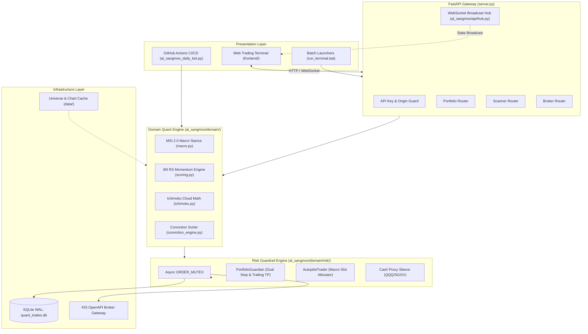

# R-Quant System: Al-Sangmoo Systematic Quant Trading Platform

[English](README.md) | [한국어](README.ko.md)


A systematic algorithmic swing-trading and risk management platform designed for US equity markets. The system digitizes the 17-year quantitative trading doctrine of former proprietary trader Alex Oh (알상무)—featuring Ichimoku Cloud crossovers, 3-Month Relative Strength (RS), macroeconomic regime filtering, strict integer position sizing, and disciplined stop-loss execution to eliminate emotional trading errors.

---

## 30-Second Overview (TL;DR)

1. **What is this project?**  
   A practical algorithmic swing-trading system that scans top Nasdaq/S&P momentum leaders, automatically manages disciplined entries, and enforces strict risk controls (-7% End-of-Day stop, -10% Emergency stop, and +18% trailing profit).

2. **Why is it named 'Al-Sangmoo'?**  
   It was born from reverse-engineering over 50 livestream trading sessions from veteran trader 'Al-Sangmoo' (Alex Oh) using audio transcript (VTT) and NLP mining to build an emotion-free **"Digital Twin"** that executes his rules 24/7.

3. **How can I run it right now?**  
   On Windows, double-click `run_terminal.bat` (or run `python server.py`). It starts the backend on port 8000 and launches the live web dashboard in your browser.

4. **Why is the directory structured this way?**  
   - `al_sangmoo/`: Core trading logic, risk guardrails, and backend API.
   - `frontend/`: Real-time web trading dashboard.
   - `archive/`: Historical research corpus (50+ YouTube transcripts and early distillations).
   - `docs/`: System specifications and investment prospectuses.
   - `research_and_backtests/`: SEC Form N-PORT filings parser and backtesting engine.

---

## 1. Background & The Origin of 'Al-Sangmoo'

### Alex Oh's Trading Philosophy
Alex Oh (알상무) is a veteran trader with over 17 years of experience in proprietary trading and quant fund management. He advocates that retail investors consistently lose money due to emotional biases—chasing spikes, hesitating on stops, and averaging down losers. His framework focuses exclusively on leading stocks exhibiting strong Relative Strength (RS) above the benchmark (SPY), executed with pre-defined rules.

### The Genesis: Building the 'Digital Twin'
To preserve and operationalize the insights shared across 50+ extensive livestreams, this project began by extracting audio subtitles (VTT) and NLP analysis to **translate Alex Oh's investment doctrine into an emotionless algorithmic "Digital Twin"**.

### Why 'R-Quant System'?
- **R (Al / 알)**: Honors the core doctrine and founding vision of Al-Sangmoo.
- **R (Relative Strength)**: Highlights the primary alpha factor—ranking stocks that outperform the benchmark.
- **R (Rule-based Robustness)**: Represents strict execution discipline enforced by mathematical guardrails.

---

## 2. Five-Phase Evolutionary History

```
[Phase 1: Genesis & Distillation] --> [Phase 2: Forward Tracker]  --> [Phase 3: Quant SSOT Engine]  --> [Phase 4: Web Terminal]      --> [Phase 5: Hardened Verification]
50+ Livestream VTT NLP Analysis       GitHub Actions Daily Bot        Domain Quant & Risk Library       FastAPI Backend & Web Terminal   SEC N-PORT Hedge Fund Filings
Doctrine Reverse-Engineered (archive) Out-of-sample Testing (history) Concurrency ORDER_MUTEX & WAL     KIS OpenAPI Broker Gateway       Zero-bias PIT Backtester & 50+ E2E
```

1. **Phase 1 (Genesis & Knowledge Distillation)**: Codified Ichimoku Cloud crossovers, 3M RS momentum, and macroeconomic risk factors from 50+ livestream transcripts. Preserved permanently in `archive/`.
2. **Phase 2 (Autonomous Forward Tracker)**: Implemented an automated daily GitHub Actions pipeline (`daily_al_sangmoo_briefing.yml`) compiling a survivorship-bias-free empirical track record (`trade_history.csv`).
3. **Phase 3 (Domain Quant Engine & Risk Guardrails)**: Modularized quant logic, introduced the asynchronous `ORDER_MUTEX` to prevent race conditions, and hardened database persistence with SQLite WAL mode.
4. **Phase 4 (Web Trading Terminal)**: Developed an asynchronous FastAPI backend with WebSocket streaming, integrated Korea Investment & Securities (KIS) OpenAPI, and launched a zero-dependency HTML5/Canvas web terminal (`frontend/`).
5. **Phase 5 (Hardened Verification)**: Parsed SEC Form N-PORT filings, built a lookahead-bias-free PIT backtester, and implemented 50+ automated test suites.

---

## 3. Core Quantitative Framework

```
+-------------------------------------------------------------------------------+
|                             MACRO REGIME (MSI 2.0)                            |
|       Inputs: US10Y Yield, DXY, VIX, US HY OAS Spread, SPY vs 200-Day SMA     |
+---------------------------------------+---------------------------------------+
                                        |
                 +----------------------+----------------------+
                 |                                             |
        [Bull: SPY >= 200 SMA]                        [Bear: SPY < 200 SMA]
        Max 3 Active Slots (34/33/33)                 Max 2 Active Slots (25/25)
                 |                                             |
                 +----------------------+----------------------+
                                        |
+---------------------------------------v---------------------------------------+
|                       UNIVERSE SELECTION & CONVICTION                         |
|   1. 3-Month Relative Strength (RS) Momentum vs SPY Benchmark                 |
|   2. Ichimoku Cloud Filter: Price > Span A & Span B, Tenkan > Kijun, Chikou   |
|   3. SEC Form N-PORT Institutional Filing Overlap & Conviction Scoring        |
+---------------------------------------+---------------------------------------+
                                        |
+---------------------------------------v---------------------------------------+
|                         EXECUTION & RISK GUARDRAILS                           |
|   - Concurrency: Global Async Order Mutex (ORDER_MUTEX)                       |
|   - Stop-Loss: Dual Stop (EOD Close <= -7.0% | Intraday Hard <= -10.0%)       |
|   - Take-Profit: Trailing activation at +18.0% with 3.0x ATR floor            |
|   - Unallocated Capital: Auto-parked in Cash Proxy Sleeve (QQQ / SGOV / BIL)  |
+-------------------------------------------------------------------------------+
```

### Quantitative SSOT Specifications
| Parameter | Specification | Purpose |
| :--- | :--- | :--- |
| **Max Portfolio Slots (Bull)** | 3 Slots (34% / 33% / 33%) | Controlled concentration across top momentum leaders |
| **Max Portfolio Slots (Bear)** | 2 Slots (25% / 25%) | Defensive exposure reduction during structural market drawdowns |
| **End-of-Day Stop-Loss** | -7.0% | Closes position on confirmed daily market close |
| **Emergency Hard Stop** | -10.0% | Immediate intraday liquidation on gap-down or flash crash |
| **Trailing Take-Profit** | +18.0% | Activates dynamic trailing exit anchored by 3.0x ATR |
| **Cash Proxy Sleeve** | QQQ / SGOV / BIL | Eliminates cash drag while maintaining capital safety |
| **Database Persistence** | SQLite WAL Mode | Eliminates concurrency lock contention across async daemons |

---

## 4. System Architecture



---

## 5. Repository Directory Layout

```
r-quant-system/
|-- al_sangmoo/                 # Core backend package (quant algorithms, risk guardrails, broker)
|-- frontend/                   # Real-time web trading dashboard (HTML, CSS, JS, Canvas chart)
|-- docs/                       # Official system documentation and audit records
|-- research_and_backtests/     # SEC Form N-PORT filings parser & backtesting engine
|-- tests/                      # Core unit tests
|-- tools_and_tests/            # 50+ security, concurrency, idempotency, and quant tests
|-- data/                       # Chart data cache and SQLite database files
|-- daily_reports/              # Daily quant scan markdown archives
|-- archive/                    # Historical research corpus (50+ YouTube subtitles & NLP notes)
|-- server.py                   # FastAPI backend application entrypoint (port 8000)
|-- al_sangmoo_daily_bot.py     # Automated daily scanner and forward tracker bot
|-- run_terminal.bat            # One-click Windows terminal execution launcher
|-- 알상무_퀀트_터미널_실행.bat    # Korean console launcher with automatic port recovery
|-- README.md                   # Primary system documentation (English)
`-- README.ko.md                # Primary system documentation (Korean)
```

---

## 6. Getting Started

### 6.1 Prerequisites
- Python 3.11 or higher
- Git
- Modern web browser (Chrome, Edge, or Firefox)

### 6.2 Installation
```bash
# Clone repository
git clone https://github.com/DoDuekChill/r-quant-system.git
cd r-quant-system

# Create and activate virtual environment
python -m venv venv
# Windows:
.\venv\Scripts\activate
# Linux/macOS:
source venv/bin/activate

# Install required packages
pip install --upgrade pip
pip install -r requirements.txt
```

### 6.3 Environment Configuration
Copy `.env.example` to `.env`:

```bash
cp .env.example .env
```

Configure with your broker API keys. **Never commit `.env` or personal credentials to version control.**

```ini
# Environment Mode: 'paper' (Simulation) or 'live' (Real Trading)
ENVIRONMENT=paper

# Korea Investment & Securities (KIS) OpenAPI Credentials (Dummy placeholders)
KIS_APP_KEY=your_kis_app_key_here
KIS_APP_SECRET=your_kis_app_secret_here
KIS_CANO=12345678
KIS_ACNT_PRDT_CD=01

# System Security
API_SECRET_KEY=your_random_secret_token_here
REQUIRE_AUTH=false

# Quant Engine Parameters
STOP_LOSS_PCT=0.07
EMERGENCY_STOP_LOSS_PCT=0.10
TAKE_PROFIT_PCT=0.18
```

### 6.4 Running the Platform

#### Method 1: One-Click Windows Launcher
Double-click `run_terminal.bat`. It clears stale processes on port 8000, starts the server, and opens the dashboard in your default browser.

```cmd
run_terminal.bat
```

#### Method 2: Manual Command Line
```bash
python server.py
```

Access the trading terminal at: `http://localhost:8000`

---

## 7. Verification & Automated Testing

```bash
# Quant scoring & MSI unit tests
pytest tools_and_tests/test_domain_quant.py -v

# SSOT risk constant invariants
pytest tools_and_tests/test_risk_constants_ssot.py -v

# Stop-loss and trailing take-profit mechanics
pytest tools_and_tests/test_backtest_stop_ssot.py -v

# Order idempotency under network retry
pytest tools_and_tests/test_idempotent_kis_order.py -v
```

---

## 8. Security & Disclaimer

- **No Investment Advice**: This software is developed for personal research and educational purposes. Algorithmic trading involves financial risk.
- **Credential Protection**: Broker API keys, secrets, and account numbers must remain confined to `.env`. The repository's `.gitignore` strictly excludes all credential and token files.

---

## 9. License

This project is licensed under the MIT License. See [LICENSE](LICENSE) for details.
