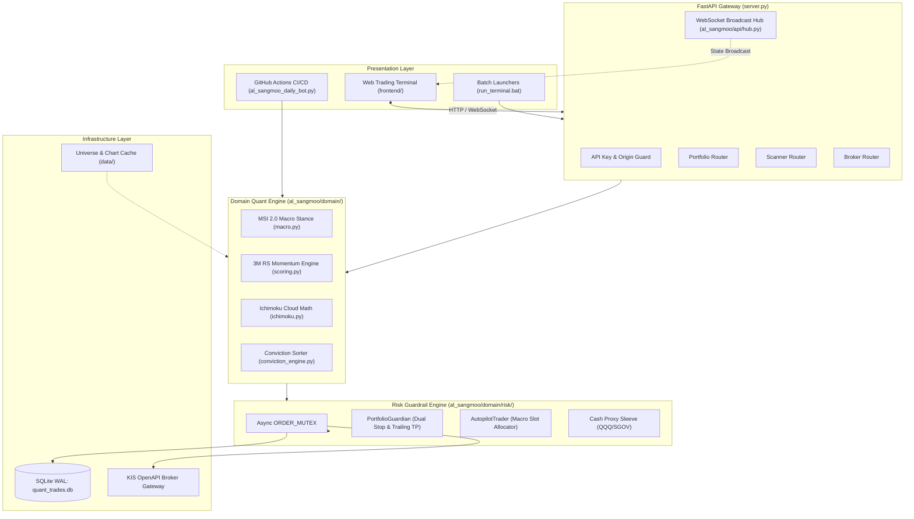

# R-Quant System: Al-Sangmoo Institutional Quant Platform

[English](README.md) | [한국어](README.ko.md)


An institutional-grade algorithmic swing-trading and risk management platform designed for US equity markets. The system digitizes the 17-year quantitative investment doctrine of former Wall Street proprietary trader and hedge fund manager Alex Oh (알상무). It is built on an asynchronous FastAPI backend, an SQLite Write-Ahead Logging (WAL) single-source-of-truth persistence layer, a real-time WebSocket broadcast hub, a Korea Investment & Securities (KIS) OpenAPI broker gateway, and a low-latency Bloomberg-style web trading terminal.

---

## 1. Background & The Origin of 'Al-Sangmoo'

### Who is 'Al-Sangmoo' (Alex Oh)?
'Al-Sangmoo' is the professional pseudonym of Alex Oh, a veteran quant portfolio manager and proprietary trader with over 17 years of experience on Wall Street and global hedge funds. Throughout his career, he emphasized that retail investors consistently suffer losses due to human emotional biases, panic selling, and unstructured intuition. On his market livestreams, he advocated for a purely mechanical, rules-based trading philosophy targeting leading momentum stocks with high relative strength and structural trend support.

### The Genesis: Building the 'Al-Sangmoo Digital Twin'
Because oral insights from 50+ extensive livestream broadcasts are ephemeral and prone to being forgotten, this project was initiated to **reverse-engineer Alex Oh's entire investment philosophy into an algorithmic "Digital Twin"**. By extracting raw audio subtitles (VTT) and running NLP text analysis across his entire video corpus, his trading rules—Ichimoku Cloud breakouts, Tenkan-Kijun golden crosses, 3-Month Relative Strength (RS), Macro Stance Index (MSI), and asymmetric stop/trailing profit rules—were formalized into mathematical code that operates 24/7 without emotional hesitation.

### Why 'R-Quant System'?
- **R (Al / 알)**: Honors the core doctrine and founding vision of Al-Sangmoo.
- **R (Relative Strength)**: Highlights the primary alpha driver—ranking the top momentum stocks that outperform the benchmark (SPY).
- **R (Rule-based & Robustness)**: Represents the strict execution discipline enforced by mathematical guardrails.

---

## 2. Five-Phase Evolutionary History

The platform evolved across five distinct engineering milestones, transitioning from a video knowledge distillation project into an institutional algorithmic trading platform:

```
[Phase 1: Genesis & Distillation] --> [Phase 2: Forward Tracker]  --> [Phase 3: Quant SSOT Engine]  --> [Phase 4: Full-Stack Platform] --> [Phase 5: C-2 Hardening]
50+ Livestream VTT NLP Analysis       GitHub Actions Daily Bot        Domain Quant & Risk Library       FastAPI Backend & Web Terminal   SEC N-PORT Hedge Fund Filings
Doctrine Reverse-Engineered (archive) Out-of-sample Testing (history) Concurrency ORDER_MUTEX & WAL     KIS OpenAPI Broker Gateway       Zero-bias PIT Backtester & 50+ E2E
```

### Phase 1: Genesis & Knowledge Distillation (`archive/`)
- Ingested over 50 livestream audio subtitles (VTT) and market discussions from Alex Oh.
- Extracted and codified the mathematical conditions for Ichimoku Cloud crossovers, 3-Month Relative Strength (RS) momentum, and macroeconomic risk factors.
- Archived the entire raw corpus, NLP scripts, and distillation documents permanently in the `archive/` directory.

### Phase 2: Autonomous Forward Tracking & Self-Verification (`al_sangmoo_daily_bot.py`)
- Established an automated daily pipeline via GitHub Actions (`daily_al_sangmoo_briefing.yml`) executing after US market close.
- Tracked post-recommendation performance dynamically (`trade_history.csv`), compiling an empirical, survivorship-bias-free track record of strategy effectiveness.

### Phase 3: Domain Quant Engine & SSOT Risk Guardrails (`al_sangmoo/domain/`)
- Decoupled quantitative logic into modular packages: `macro.py`, `scoring.py`, `conviction_engine.py`, and `position_sizer.py`.
- Introduced the global asynchronous `ORDER_MUTEX` to prevent race conditions during rapid concurrent fill events.
- Hardened database persistence with SQLite WAL mode and atomic transaction management.

### Phase 4: Full-Stack Real-Time Platform (`server.py`, `frontend/`)
- Built an asynchronous FastAPI REST API and WebSocket broadcast hub (`al_sangmoo/api/hub.py`) for live balance and order streaming.
- Developed an institutional gateway for Korea Investment & Securities (KIS) OpenAPI supporting live and paper trading accounts with automated token lifecycle handling.
- Designed and launched a zero-dependency HTML5/Canvas Bloomberg/TradingView style web terminal (`frontend/`).

### Phase 5: C-2 Institutional Expansion & Hardened Verification (`research_and_backtests/`, `tools_and_tests/`)
- Engineered an SEC Form N-PORT filing parser tracking quarterly holdings across 500 top US hedge funds.
- Built a Point-in-Time (PIT) backtester with zero lookahead bias.
- Established 50+ automated test suites covering security authorization, multi-threaded concurrency, order idempotency, and quantitative SSOT invariants.

---

## 3. Core Quantitative Framework

```
+-------------------------------------------------------------------------------+
|                             MACRO REGIME (MSI 2.0)                            |
|       Inputs: US10Y Yield, DXY, VIX, US HY OAS Spread, SPY vs 200-Day SMA     |
+---------------------------------------+---------------------------------------+
                                        |
                 +----------------------+----------------------+
                 |                                             |
        [Bull: SPY >= 200 SMA]                        [Bear: SPY < 200 SMA]
        Max 3 Active Slots (34/33/33)                 Max 2 Active Slots (25/25)
                 |                                             |
                 +----------------------+----------------------+
                                        |
+---------------------------------------v---------------------------------------+
|                       UNIVERSE SELECTION & CONVICTION                         |
|   1. 3-Month Relative Strength (RS) Momentum vs SPY Benchmark                 |
|   2. Ichimoku Cloud Filter: Price > Span A & Span B, Tenkan > Kijun, Chikou   |
|   3. SEC Form N-PORT Institutional Filing Overlap & Conviction Scoring        |
+---------------------------------------+---------------------------------------+
                                        |
+---------------------------------------v---------------------------------------+
|                         EXECUTION & RISK GUARDRAILS                           |
|   - Concurrency: Global Async Order Mutex (ORDER_MUTEX)                       |
|   - Stop-Loss: Dual Stop (EOD Close <= -7.0% | Intraday Hard <= -10.0%)       |
|   - Take-Profit: Trailing activation at +18.0% with 3.0x ATR floor            |
|   - Unallocated Capital: Auto-parked in Cash Proxy Sleeve (QQQ / SGOV / BIL)  |
+-------------------------------------------------------------------------------+
```

### Quantitative SSOT Specifications
| Parameter | Specification | Purpose |
| :--- | :--- | :--- |
| **Max Portfolio Slots (Bull)** | 3 Slots (34% / 33% / 33%) | Controlled concentration across top momentum leaders |
| **Max Portfolio Slots (Bear)** | 2 Slots (25% / 25%) | Defensive exposure reduction during structural market drawdowns |
| **End-of-Day Stop-Loss** | -7.0% | Closes position on confirmed daily market close |
| **Emergency Hard Stop** | -10.0% | Immediate intraday liquidation on gap-down or flash crash |
| **Trailing Take-Profit** | +18.0% | Activates dynamic trailing exit anchored by 3.0x ATR |
| **Cash Proxy Sleeve** | QQQ / SGOV / BIL | Eliminates cash drag while maintaining capital safety |
| **Database Persistence** | SQLite WAL Mode | Eliminates concurrency lock contention across async daemons |

---

## 4. System Architecture



---

## 5. Repository Directory Layout

```
r-quant-system/
|-- al_sangmoo/                 # Production backend core package
|   |-- api/                    # WebSocket connection hub and broadcaster
|   |-- backtest/               # Strategy backtesting engine
|   |-- core/                   # Constants, US market calendar, config loader
|   |-- domain/                 # Pure quantitative models (Macro, RS, Ichimoku)
|   |   `-- risk/               # Risk guardrails (Mutex, Guardian, Autopilot, Proxy)
|   |-- infrastructure/         # SQLite persistence, atomic file I/O, KIS broker
|   `-- interfaces/api/routers/ # FastAPI REST API routers
|-- frontend/                   # Real-time Bloomberg-style trading terminal
|   |-- css/                    # Dark terminal styling (terminal.css)
|   `-- js/                     # Modular JavaScript (ui.js, api.js, websocket.js, chart.js)
|-- docs/                       # Official system documentation and audit records
|   |-- archive/                # Legacy architecture notes and design audits
|   |-- handoffs/               # Engineering session handoff documents
|   |-- prospectus/             # Investment prospectuses (C1/M2, C2) in EN and KO
|   `-- superpowers/            # Architecture specifications and implementation plans
|-- research_and_backtests/     # SEC Form N-PORT institutional filing parser & backtester
|-- tests/                      # Core integration tests
|-- tools_and_tests/            # 50+ E2E, security, concurrency, and quant unit tests
|-- data/                       # Local universe snapshots, chart data, SQLite database files
|-- daily_reports/              # Markdown archives of daily quant briefing runs
|-- archive/                    # Historical research corpus (YouTube subtitles, NLP distillations)
|   |-- al_sangmoo_distill/     # 50-episode live transcript NLP extractions and notes
|   |-- al_sangmoo_transcripts/ # Raw VTT subtitles from initial research
|   `-- transcripts_and_raw_data/# Corpus text files and video index metadata
|-- server.py                   # FastAPI backend application entrypoint
|-- al_sangmoo_daily_bot.py     # GitHub Actions morning scanner and forward tracker bot
|-- generate_dashboard_feed.py  # Dashboard precomputed JSON feed generator
|-- run_terminal.bat            # Cross-platform Windows execution launcher
|-- 알상무_퀀트_터미널_실행.bat    # Korean console launcher with automatic port recovery
|-- PROJECT.md                  # System architecture inventory and milestone tracking
|-- TEST_INFRA.md               # Test infrastructure guidelines
|-- README.md                   # Primary system documentation (English)
`-- README.ko.md                # Primary system documentation (Korean)
```

---

## 6. Getting Started

### 6.1 Prerequisites
- Python 3.11 or higher
- Git
- Modern web browser (Chrome, Edge, or Firefox)

### 6.2 Installation
```bash
# Clone repository
git clone https://github.com/DoDuekChill/r-quant-system.git
cd r-quant-system

# Create and activate virtual environment
python -m venv venv
# Windows:
.\venv\Scripts\activate
# Linux/macOS:
source venv/bin/activate

# Install required packages
pip install --upgrade pip
pip install -r requirements.txt
```

### 6.3 Environment Configuration
Copy the template configuration file to `.env`:

```bash
cp .env.example .env
```

Edit `.env` with your broker credentials and operational settings. **Never commit `.env` or personal credentials to version control.**

```ini
# Environment Mode: 'paper' (Mock/Simulation) or 'live' (Real Trading)
ENVIRONMENT=paper

# Korea Investment & Securities (KIS) OpenAPI Credentials
KIS_APP_KEY=your_kis_app_key_here
KIS_APP_SECRET=your_kis_app_secret_here
KIS_CANO=12345678
KIS_ACNT_PRDT_CD=01

# System Security
API_SECRET_KEY=your_random_secret_token_here
REQUIRE_AUTH=false

# Quant Engine Parameters
STOP_LOSS_PCT=0.07
EMERGENCY_STOP_LOSS_PCT=0.10
TAKE_PROFIT_PCT=0.18
```

### 6.4 Running the Platform

#### Method 1: One-Click Windows Launcher
Double-click `run_terminal.bat` (or execute it via PowerShell / Command Prompt). The script automatically clears stale listeners on port 8000, launches the FastAPI server, and opens the trading terminal in your default browser.

```cmd
run_terminal.bat
```

#### Method 2: Manual Command Line
```bash
python server.py
```

Once started, access the web trading terminal at:
```
http://localhost:8000
```

---

## 7. Verification & Automated Testing

The platform maintains an automated test suite covering security authorization, SQLite WAL concurrency, order idempotency, and quantitative SSOT invariants.

### Running Core Unit Tests
```bash
# Quant domain scoring & MSI validation
pytest tools_and_tests/test_domain_quant.py -v

# Risk constants and SSOT invariants
pytest tools_and_tests/test_risk_constants_ssot.py -v

# Stop-loss and trailing take-profit mechanics
pytest tools_and_tests/test_backtest_stop_ssot.py -v
```

### Running Concurrency & Broker Tests
```bash
# Order idempotency under network retry
pytest tools_and_tests/test_idempotent_kis_order.py -v

# Multi-threaded SQLite transaction integrity
pytest tools_and_tests/test_phase5_2_concurrency.py -v

# Autopilot macro slot allocation & portfolio sync
pytest tests/test_autopilot.py -v
```

---

## 8. Security & Compliance Notice

- **No Financial Advice**: This software is engineered for educational and research purposes. Algorithmic trading entails substantial risk of capital loss.
- **Credential Protection**: API keys, broker app secrets, and account numbers must remain confined to `.env` and environment variables. The `.gitignore` configuration excludes all credential files and token caches.
- **Idempotency Safeguards**: The trading engine enforces local and broker-side deduplication keys to protect against duplicate fills during network timeouts.

---

## 9. License

This project is licensed under the MIT License. See [LICENSE](LICENSE) for details.
