# R-Quant System: Al-Sangmoo Institutional Quant Platform


An institutional-grade algorithmic swing-trading and risk management platform designed for US equity markets. The system implements the quantitative investment doctrine of 17-year hedge fund manager Alex Oh (알상무), engineered on an asynchronous FastAPI backend, SQLite Write-Ahead Logging (WAL) single-source-of-truth persistence layer, real-time WebSocket broadcast hub, Korea Investment & Securities (KIS) OpenAPI integration, and a low-latency web trading terminal.

---

## 1. Executive Summary

The R-Quant System combines macro regime detection, momentum scoring, and strict risk guardrails to automate swing-trading execution. The platform operates under an absolute risk-first philosophy: capital preservation is enforced through automated hard stop-losses, macro-conditioned position sizing, dynamic cash proxy allocation, and mutual-exclusion order execution.

### Key Capabilities
- **Macro Regime Filtering (MSI 2.0)**: Multi-factor risk gauge (US 10Y Yield, DXY, VIX, High Yield Spread, SPY 200 SMA) determining system stance across Active Buy, Selective Buy, Defense Hold, and Cash Exit regimes.
- **Quantitative Stock Selection**: 3-Month Relative Strength (RS) momentum ranking combined with Ichimoku Cloud (구름대) structural breakouts and Tenkan-Kijun golden crosses.
- **Deterministic Capital Allocation**: 3-slot integer share allocation (34% / 33% / 33% in Bull regimes; 25% / 25% in Bear regimes) with automated Cash Proxy parking (QQQ/SGOV/BIL).
- **Asymmetric Risk Controls**: Dual Stop-Loss (-7.0% End-of-Day soft stop, -10.0% Intraday emergency hard stop) and +18.0% trailing take-profit with 3.0x ATR volatility trailing floor.
- **Institutional Broker Gateway**: Korea Investment & Securities (KIS) OpenAPI gateway supporting live and paper trading accounts with automatic token refresh and failover safeguards.
- **Real-Time Web Terminal**: WebSocket-driven Bloomberg/TradingView style dashboard providing live portfolio valuation, real-time order entry, universe health indicators, and interactive technical charts.

---

## 2. Core Quantitative Framework

```
+-------------------------------------------------------------------------------+
|                             MACRO REGIME (MSI 2.0)                            |
|       Inputs: US10Y Yield, DXY, VIX, US HY OAS Spread, SPY vs 200-Day SMA     |
+---------------------------------------+---------------------------------------+
                                        |
                 +----------------------+----------------------+
                 |                                             |
        [Bull: SPY >= 200 SMA]                        [Bear: SPY < 200 SMA]
        Max 3 Active Slots (34/33/33)                 Max 2 Active Slots (25/25)
                 |                                             |
                 +----------------------+----------------------+
                                        |
+---------------------------------------v---------------------------------------+
|                       UNIVERSE SELECTION & CONVICTION                         |
|   1. 3-Month Relative Strength (RS) Momentum vs SPY Benchmark                 |
|   2. Ichimoku Cloud Filter: Price > Span A & Span B, Tenkan > Kijun, Chikou   |
|   3. SEC Form N-PORT Institutional Filing Overlap & Conviction Scoring        |
+---------------------------------------+---------------------------------------+
                                        |
+---------------------------------------v---------------------------------------+
|                         EXECUTION & RISK GUARDRAILS                           |
|   - Concurrency: Global Async Order Mutex (ORDER_MUTEX)                       |
|   - Stop-Loss: Dual Stop (EOD Close <= -7.0% | Intraday Hard <= -10.0%)       |
|   - Take-Profit: Trailing activation at +18.0% with 3.0x ATR floor            |
|   - Unallocated Capital: Auto-parked in Cash Proxy Sleeve (QQQ / SGOV / BIL)  |
+-------------------------------------------------------------------------------+
```

### Quantitative SSOT Specifications
| Parameter | Specification | Purpose |
| :--- | :--- | :--- |
| **Max Portfolio Slots (Bull)** | 3 Slots (34% / 33% / 33%) | Controlled concentration across top momentum leaders |
| **Max Portfolio Slots (Bear)** | 2 Slots (25% / 25%) | Defensive exposure reduction during structural market drawdowns |
| **End-of-Day Stop-Loss** | -7.0% | Closes position on market close confirmation |
| **Emergency Hard Stop** | -10.0% | Immediate intraday liquidation on gap-down or flash crash |
| **Trailing Take-Profit** | +18.0% | Activates dynamic trailing exit anchored by 3.0x ATR |
| **Cash Proxy Sleeve** | QQQ / SGOV / BIL | Eliminates cash drag while maintaining capital safety |
| **Database Persistence** | SQLite WAL Mode | Eliminates concurrency lock contention across async daemons |

---

## 3. Project Evolution & History

The system transitioned through five distinct engineering phases, evolving from initial video knowledge extraction into a hardened institutional algorithmic trading infrastructure:

```
[Phase 1: Genesis]        [Phase 2: Bot]             [Phase 3: SSOT Engine]    [Phase 4: Platform]      [Phase 5: C-2 Hardening]
YouTube Live Corpus  -->  GitHub Actions Daily  -->  Domain Quant Engine  -->  FastAPI Server      -->  SEC N-PORT PIT Engine
NLP Distillation          Briefing & Tracker         Risk Guardrail Mutex      WebSocket Web Terminal   50+ Adversarial Tests
(archive/)                (al_sangmoo_daily_bot)     (al_sangmoo/domain)       (server.py / frontend)   (research_and_backtests)
```

### Phase 1: Genesis & Knowledge Distillation (`archive/`)
- Reverse-engineered the proprietary trading doctrine of 17-year quant hedge fund manager Alex Oh from 50+ live broadcasts.
- Subtitle extraction (VTT), NLP text parsing, and structured investment doctrine documentation (`archive/al_sangmoo_distill/`, `archive/transcripts_and_raw_data/`).
- Formalized mathematical definitions for the Ichimoku Cloud breakout conditions and Macro Stance Index.

### Phase 2: Autonomous Morning Briefing & Forward Tracker (`al_sangmoo_daily_bot.py`)
- Constructed an automated daily pipeline executing via GitHub Actions (`daily_al_sangmoo_briefing.yml`) on US market close.
- Automated universe scanning across top 30 Nasdaq/S&P names, generating daily recommendation reports (`daily_reports/`).
- Initiated live forward tracking (`trade_history.csv`) to validate model effectiveness out-of-sample with zero survivor bias.

### Phase 3: Domain Quant Engine & SSOT Risk Guardrails (`al_sangmoo/domain/`)
- Established single-source-of-truth (SSOT) modular quant libraries: `macro.py`, `scoring.py`, `conviction_engine.py`, and `position_sizer.py`.
- Introduced asynchronous execution synchronization with `ORDER_MUTEX` to prevent race conditions during rapid multi-ticker fill events.
- Hardened database persistence layer (`al_sangmoo/infrastructure/persistence.py`) using SQLite WAL mode and atomic transaction rollbacks.

### Phase 4: Full-Stack Real-Time Platform (`server.py`, `frontend/`)
- Developed a high-throughput FastAPI asynchronous application serving REST endpoints and WebSocket broadcast feeds (`al_sangmoo/api/hub.py`).
- Integrated Korea Investment & Securities (KIS) OpenAPI with automated OAuth2 token caching and error retry handlers (`al_sangmoo/infrastructure/brokers/kis_broker.py`).
- Built a native HTML5/Canvas Bloomberg-style trading terminal (`frontend/`) supporting live chart rendering, portfolio rebalancing, and audit logs.

### Phase 5: C-2 Institutional Bundle & Hardened Verification (`research_and_backtests/`, `tools_and_tests/`)
- Implemented institutional filing analysis via Point-in-Time (PIT) SEC Form N-PORT filing parser (`research_and_backtests/fetch_sec_nport_holdings.py`), tracking top 500 hedge fund holdings.
- Built a lookahead-bias-free PIT backtesting engine (`research_and_backtests/pit_sec_nport_backtester.py`).
- Established 50+ end-to-end and adversarial test suites validating security, concurrency, order idempotency, and quantitative guardrails.

---

## 4. System Architecture

```mermaid
flowchart TD
    subgraph ClientLayer["Presentation Layer"]
        UI["Web Trading Terminal (frontend/)"]
        CLI["Batch Launchers (run_terminal.bat)"]
        GHA["GitHub Actions CI/CD (al_sangmoo_daily_bot.py)"]
    end

    subgraph APILayer["FastAPI Gateway (server.py)"]
        Auth["API Key & Origin Guard"]
        RouterPortfolio["Portfolio Router"]
        RouterScanner["Scanner Router"]
        RouterBroker["Broker Router"]
        WSHub["WebSocket Broadcast Hub (al_sangmoo/api/hub.py)"]
    end

    subgraph QuantLayer["Domain Quant Engine (al_sangmoo/domain/)"]
        Macro["MSI 2.0 Macro Stance (macro.py)"]
        Momentum["3M RS Momentum Engine (scoring.py)"]
        Ichimoku["Ichimoku Cloud Math (ichimoku.py)"]
        Conviction["Conviction Sorter (conviction_engine.py)"]
    end

    subgraph RiskLayer["Risk Guardrail Engine (al_sangmoo/domain/risk/)"]
        Mutex["Async ORDER_MUTEX"]
        Guardian["PortfolioGuardian (Dual Stop & Trailing TP)"]
        Autopilot["AutopilotTrader (Macro Slot Allocator)"]
        Proxy["Cash Proxy Sleeve (QQQ/SGOV)"]
    end

    subgraph InfraLayer["Infrastructure Layer"]
        DB[(SQLite WAL: quant_trades.db)]
        KISGateway["KIS OpenAPI Broker Gateway"]
        DataCache["Universe & Chart Cache (data/)"]
    end

    UI <-->|HTTP / WebSocket| APILayer
    CLI --> APILayer
    GHA --> QuantLayer

    APILayer --> QuantLayer
    QuantLayer --> RiskLayer
    RiskLayer --> Mutex
    Mutex --> KISGateway
    Mutex --> DB
    WSHub -.->|State Broadcast| UI
    DataCache -.-> QuantLayer
```



---

## 5. Repository Directory Layout

```
r-quant-system/
|-- al_sangmoo/                 # Production backend core package
|   |-- api/                    # WebSocket connection hub and broadcaster
|   |-- backtest/               # Legacy strategy backtesting engine
|   |-- core/                   # Constants, market calendar, config loader
|   |-- domain/                 # Pure quantitative models (Macro, RS, Ichimoku)
|   |   `-- risk/               # Risk guardrails (Mutex, Guardian, Autopilot)
|   |-- infrastructure/         # SQLite persistence, atomic file I/O, KIS broker
|   `-- interfaces/api/routers/ # FastAPI APIRouters (portfolio, charts, broker)
|-- frontend/                   # Real-time Bloomberg-style trading terminal
|   |-- css/                    # Terminal styling (terminal.css)
|   `-- js/                     # Modular JavaScript (ui.js, api.js, websocket.js, chart.js)
|-- docs/                       # Official system documentation and audit records
|   |-- archive/                # Legacy architecture notes and design audits
|   |-- handoffs/               # Engineering session handoff documents
|   |-- prospectus/             # Investment prospectuses (C1/M2, C2) in EN and KO
|   `-- superpowers/            # Architecture specifications and implementation plans
|-- research_and_backtests/     # SEC Form N-PORT institutional filing parser & backtester
|-- tests/                      # Core integration tests
|-- tools_and_tests/            # 50+ E2E, security, concurrency, and quant unit tests
|-- data/                       # Local universe snapshots, chart data, SQLite database files
|-- daily_reports/              # Markdown archives of daily quant briefing runs
|-- archive/                    # Historical research corpus (YouTube subtitles, NLP distillations)
|   |-- al_sangmoo_distill/     # 50-episode live transcript NLP extractions and notes
|   |-- al_sangmoo_transcripts/ # Raw VTT subtitles from initial research
|   `-- transcripts_and_raw_data/# Corpus text files and video index metadata
|-- server.py                   # FastAPI backend application entrypoint
|-- al_sangmoo_daily_bot.py     # GitHub Actions morning scanner and forward tracker bot
|-- generate_dashboard_feed.py  # Dashboard precomputed JSON feed generator
|-- run_terminal.bat            # Cross-platform Windows execution launcher
|-- 알상무_퀀트_터미널_실행.bat    # Korean console launcher with automatic port recovery
|-- PROJECT.md                  # System architecture inventory and milestone tracking
|-- TEST_INFRA.md               # Test infrastructure guidelines
`-- README.md                   # Primary system documentation
```

---

## 6. Getting Started

### 6.1 Prerequisites
- Python 3.11 or higher
- Git
- Modern web browser (Chrome, Edge, or Firefox)

### 6.2 Installation
Clone the repository and install the dependencies in a clean virtual environment:

```bash
# Clone repository
git clone https://github.com/DoDuekChill/r-quant-system.git
cd r-quant-system

# Create and activate virtual environment
python -m venv venv
# Windows:
.\venv\Scripts\activate
# Linux/macOS:
source venv/bin/activate

# Install required packages
pip install --upgrade pip
pip install -r requirements.txt
```

### 6.3 Environment Configuration
Copy the template configuration file to `.env`:

```bash
cp .env.example .env
```

Edit `.env` with your broker credentials and operational settings. **Never commit `.env` or personal credentials to version control.**

```ini
# Environment Mode: 'paper' (Mock/Simulation) or 'live' (Real Trading)
ENVIRONMENT=paper

# Korea Investment & Securities (KIS) OpenAPI Credentials
KIS_APP_KEY=your_kis_app_key_here
KIS_APP_SECRET=your_kis_app_secret_here
KIS_CANO=12345678
KIS_ACNT_PRDT_CD=01

# System Security
API_SECRET_KEY=your_random_secret_token_here
REQUIRE_AUTH=false

# Quant Engine Parameters
STOP_LOSS_PCT=0.07
EMERGENCY_STOP_LOSS_PCT=0.10
TAKE_PROFIT_PCT=0.18
```

### 6.4 Running the Platform

#### Method 1: One-Click Windows Launcher
Double-click `run_terminal.bat` (or execute it via PowerShell / Command Prompt). The script automatically clears stale listeners on port 8000, launches the FastAPI server, and opens the trading terminal in your default browser.

```cmd
run_terminal.bat
```

#### Method 2: Manual Command Line
```bash
python server.py
```

Once started, access the web trading terminal at:
```
http://localhost:8000
```

---

## 7. Verification & Automated Testing

The platform maintains an automated test suite covering security authorization, SQLite WAL concurrency, order idempotency, and quantitative SSOT invariants.

### Running Core Unit Tests
```bash
# Quant domain scoring & MSI validation
pytest tools_and_tests/test_domain_quant.py -v

# Risk constants and SSOT invariants
pytest tools_and_tests/test_risk_constants_ssot.py -v

# Stop-loss and trailing take-profit mechanics
pytest tools_and_tests/test_backtest_stop_ssot.py -v
```

### Running Concurrency & Broker Tests
```bash
# Order idempotency under network retry
pytest tools_and_tests/test_idempotent_kis_order.py -v

# Multi-threaded SQLite transaction integrity
pytest tools_and_tests/test_phase5_2_concurrency.py -v

# Autopilot macro slot allocation & portfolio sync
pytest tests/test_autopilot.py -v
```

---

## 8. Security & Compliance Notice

- **No Financial Advice**: This software is engineered for educational and research purposes. Algorithmic trading entails substantial risk of capital loss.
- **Credential Protection**: API keys, broker app secrets, and account numbers must remain confined to `.env` and environment variables. The `.gitignore` configuration excludes all credential files and token caches.
- **Idempotency Safeguards**: The trading engine enforces local and broker-side deduplication keys to protect against duplicate fills during network timeouts.

---

## 9. License

This project is licensed under the MIT License. See [LICENSE](LICENSE) for details.
