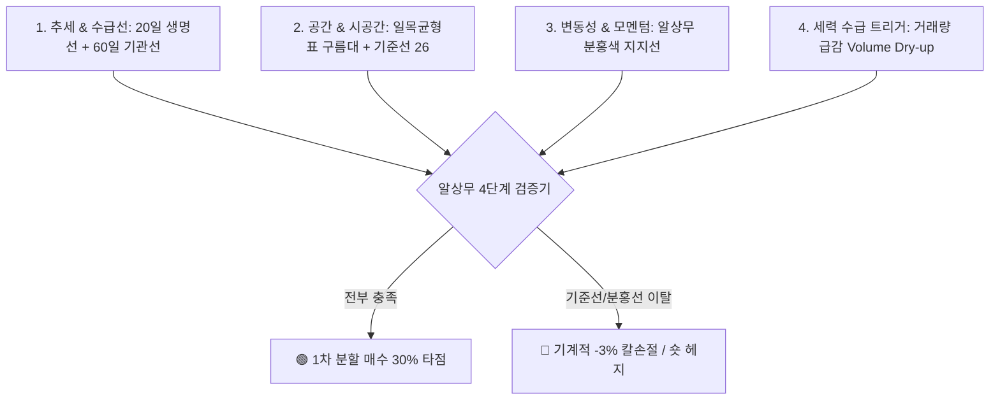

# 📐 알상무 실전 퀀트 차트 지표 콤보 시스템 (The R's Indicator Trinity)

> **핵심 설계**: 알상무의 17년 프랍/헤지펀드 실무 노하우(일목균형표 + 20/60일선 + 분홍색 지지선 + 거래량 마름)를 **정량적 수식과 4단계 알고리즘**으로 체계화한 차트 분석표 조합입니다.

---

## 🎯 1. 알상무 4대 지표 콤보 아키텍처

단일 보조지표의 잦은 휩소(속임수)를 방지하기 위해 **서로 다른 성격의 4가지 지표가 교차 검증**되도록 설계되었습니다.

---

## 🔢 2. 지표별 수학적 정의 및 파라미터 세팅

### ① 일목균형표 (Ichimoku Kinko Hyo)
* **전환선 (Tenkan-sen, 9일)**: $\frac{\text{Highest High}(9) + \text{Lowest Low}(9)}{2}$ ➔ *단기 모멘텀*
* **기준선 (Kijun-sen, 26일)**: $\frac{\text{Highest High}(26) + \text{Lowest Low}(26)}{2}$ ➔ **★ 알상무의 핵심 생명선**
* **선행스팬 1 (Senkou Span A)**: $\frac{\text{전환선} + \text{기준선}}{2}$ (26일 선행)
* **선행스팬 2 (Senkou Span B)**: $\frac{\text{Highest High}(52) + \text{Lowest Low}(52)}{2}$ (26일 선행)
* **구름대(Kumo)**: 선행스팬 1과 2 사이의 영역 ➔ *양운(초록 지지), 음운(빨강 저항)*

### ② 알상무 '분홍색 지지선' (Dynamic Pink Trend Line)
* **산출 수식**: 최근 3개 이상 주요 저점(Swing Lows, $L_1, L_2, L_3$)을 선형 회귀 또는 최저점 연결 직선으로 작도.
* **특징**: 주가가 하락할 때마다 지지선이 단계별로 하향 수정되지만, **"현재 그어진 분홍색 선을 종가로 깨면 무조건 1차 리스크를 줄인다"**는 엄격한 기준.

### ③ 20일 거래량 마름 (Volume Dry-Up, VDU)
* **산출 수식**: $\text{Volume}_{\text{today}} < \text{SMA}(\text{Volume}, 20) \times 0.5$
* **의미**: 주가가 20일선이나 일목 기준선까지 눌림목을 받을 때 **거래량이 20일 평균의 50% 이하로 바짝 마르는 현상** (개미 털기 완료 신호).

---

## 🚦 3. 알상무 4대 매매 알고리즘 조건식

| 매매 신호 | 조건 수식 (Logical Formula) | 행동 요령 |
| :--- | :--- | :--- |
| 🟢 **[빈집 매집 / 1차 매수]** | $\text{Close} > \text{Span A} \land \text{Close} \ge \text{Kijun}(26) \land \text{Vol} < \text{SMA}(\text{Vol},20)\times 0.6$ | **계좌 비중 30% 1차 진입** |
| 🚀 **[2차 불타기 / 급등]** | $\text{Tenkan}(9) \text{ CrossAbove } \text{Kijun}(26) \land \text{Vol} > \text{SMA}(\text{Vol},20)\times 2.0$ | **계좌 비중 40% 추가 매수** |
| 🟡 **[음모론 / 분할 익절]** | $\text{Close} > \text{BB Upper}(20, 2) \land \text{RSI}(14) \ge 75$ | **보유 물량의 30~50% 차익 실현** |
| 🔴 **[알반꿀 방지 / 칼손절]** | $\text{Close} < \text{Kijun}(26) \lor \text{Close} < \text{Pink\_Line} \lor \text{PnL} \le -3\%$ | **이유 불문 기계적 전량 손절** |

---

## 🖥️ 4. 인터랙티브 실전 대시보드 파일

위 차트 지표 콤보를 TradingView 엔진으로 직접 시각화한 인터랙티브 웹앱이 생성되어 있습니다:
* 🌐 **실행 파일**: [`D:\코딩\Playground\al_sangmoo_chart_system.html`](file:///D:/%EC%BD%94%EB%94%A9/Playground/al_sangmoo_chart_system.html)
* **주요 기능**:
  * SK하이닉스, 삼성전자, NVDA, 테슬라 원클릭 종목 전환
  * 캔들 차트 + 일목 기준선(황금색) + 전환선(파란색) + 분홍색 지지선(핑크) + 60일선(보라) 동시 렌더링
  * 실시간 알상무 페르소나 진단 및 4단계 체크리스트 표시
