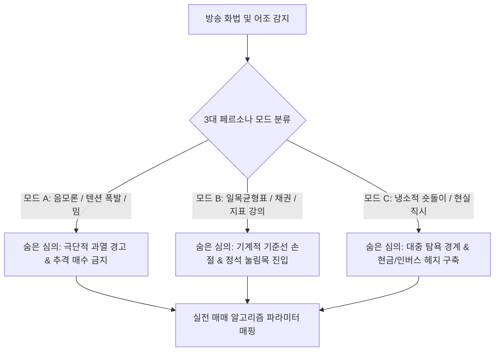

# 🧠 알상무 투자 두뇌 역추적 & 증류 알고리즘 (Distillation Framework)

> **목적**: 알상무의 50편 라이브 텍스트에서 단순한 단어 빈도가 아닌, **특유의 화법/말투, 어조의 변화, 그 이면에 숨겨진 실전 트레이딩 심의(Hidden Intent)**를 3차원 다면 분석하여 '알상무 퀀트 투자 모델'로 정량화/정성화 증류.

---

## 🎯 1. 알상무 3단계 화법-심의(Hidden Intent) 역추적 엔진

알상무의 방송은 **"예능/음모론의 겉껍질"** 속에 **"17년 제도권 펀드매니저의 냉혹한 리스크 관리 원칙"**이 숨어 있는 이중 구조를 가집니다.

---

## 🔍 2. 3대 페르소나 모드별 심의 & 매매 룰 매핑

### [모드 A] 유쾌한 음모론 / 텐션 폭발 모드
* 🗣️ **시그니처 표현**: *"~인 거 아시죠?", "프리메이슨", "지구 숏", "확정!"*
* 🎭 **표면적 뉘앙스**: 가벼운 농담, 장난스러운 썰 풀기, 시청자 도발.
* 🧠 **말 뒤에 숨겨진 진짜 심의(Hidden Intent)**:
  > *"현재 시장이 펀더멘털로 설명할 수 없는 광기/유동성 버블 구간이다. 남들 다 환호할 때 뒤늦게 불나방처럼 탑승하지 말고 조용히 빠져나올 준비를 해라."*
* ⚙️ **투자 룰 매핑**:
  * **현금 비중**: `50% 이상`으로 상향
  * **포지션 전략**: 기존 보유 종목 **분할 익절(Take-profit)** 개시, 신규 매수 금지

---

### [모드 B] 차분한 지표 분석 & 회계/매크로 강의 모드
* 🗣️ **시그니처 표현**: *"일목균형표 보시면", "전환선이 기준선을", "미 국채 10년물 금리가", "분홍색 지지선"*
* 🎭 **표면적 뉘앙스**: 진지하고 차분한 기술적/기본적 지표 분석.
* 🧠 **말 뒤에 숨겨진 진짜 심의(Hidden Intent)**:
  > *"감정에 휘둘리지 말고 오직 지표의 데이터만 믿어라. 구름대 위에 있으면 버티고, 기준선이 무너지면 미련 없이 기계적으로 잘라내라."*
* ⚙️ **투자 룰 매핑**:
  * **진입 조건**: 일목균형표 **기준선 지지 + 전환선 골든크로스** 확인 시 1차 분할 매수
  * **손절 조건**: **기준선(26일선) 종가 이탈 시 즉시 -3% 칼손절**

---

### [모드 C] 냉소적 숏돌이 & 생존주의자 모드
* 🗣️ **시그니처 표현**: *"지금 팔면 안 돼, 지난주에 팔았어야 돼", "다 털린다", "내가 17년 동안 이것만 했어"*
* 🎭 **표면적 뉘앙스**: 시장 비관, 개인 투자자에 대한 팩트 폭행.
* 🧠 **말 뒤에 숨겨진 진짜 심의(Hidden Intent)**:
  > *"시장은 당신의 돈을 털어가기 위해 존재하는 전쟁터다. 잃지 않는 것이 버는 것보다 100배 중요하다. 살아서 다음 사이클을 맞이해라."*
* ⚙️ **투자 룰 매핑**:
  * **헤지 전략**: 지수 하락 대비 **인버스/선물 숏 포지션 10~20%** 편입
  * **자산 배분**: 달러, 금, 초단기 채권 등 **방어 자산 확보**

---

## 📊 3. 50편 라이브 데이터 추출 핵심 평가 매트릭스

50개 마크다운 파일에서 다음 5대 영역을 스캔하여 최종 **`al_sangmoo_investment_doctrine.md`**로 종합 합성합니다:

1. **차트 지표론**: 일목균형표, 20/60일선, 거래량 폭증/급감, 분홍색 지지선 설정 원리
2. **거시 매크로론**: 한미 금리차, 환율(원달러/엔달러), 유동성 M2, 정부/한은 정책
3. **종목 선별론**: 빈집털이(소외주 선취매), 실적 모멘텀, 관료 체제 수혜주
4. **자금 관리론**: 분할 매수/매도 비율, 현금 버퍼 유지, 위기 시 숏 헤지 비중
5. **트레이더 멘탈론**: 손실 났을 때의 대처법, 과잉 확신 경계, 사이클 순환 수용
