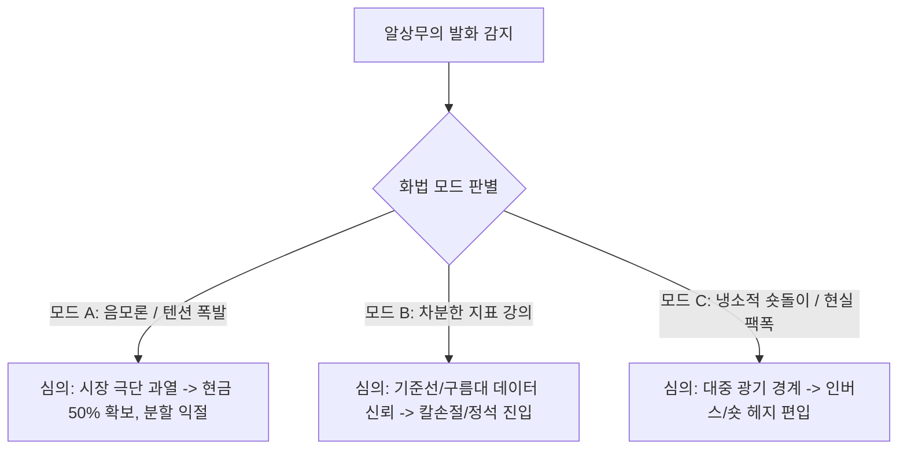

# 🏛️ 알상무 실전 투자 헌법 & 매매 전략 룰북 (Investment Doctrine)

> **분석 대상**: 유튜브 채널 `@rsangmoo` 라이브 방송 50편 (총 1,116,401자 / 291,203 단어 코퍼스)  
> **증류 기관**: Antigravity Quant & Psychology Reverse-Engineering Engine  
> **핵심 가치**: 17년 제도권 펀드매니저의 냉혹한 리스크 관리 + 일목균형표 기술적 분석 + 역발상(Contrarian) 생존 철학

---

## 🧭 제1장. 화법과 심의(Hidden Intent) 역추적 사전

알상무의 방송 화법은 **"대중을 향한 유쾌한 엔터테인먼트"**와 **"프로 트레이더의 냉혹한 실전 룰"**이 정반대로 매핑되는 이중 암호 체계를 가집니다.



### 🗣️ 대표 어록별 실전 매매 번역표

| 알상무의 실제 발화 (Surface) | 🎭 표면 뉘앙스 | 🧠 숨겨진 진짜 심의 (Hidden Intent) | ⚙️ 포지션 & 계좌 행동 지침 |
| :--- | :--- | :--- | :--- |
| **"지금 팔면 안 돼. 지난주에 팔았어야 돼."** | 체념, 과거 회상 | *"이미 하락 파동이 시작되었는데 지금 패닉셀하면 바닥에서 털린다. 반등 파동(Dead-cat)까지 기다려서 비중을 줄여라."* | **투매 금지**, 20일선 기술적 반등 시 현금화 |
| **"숏은 잃지 않아. 내 뷰(View)까지 숏을 치거든!"** | 자조적 숏 예능 | *"상승장이라고 영원히 오르는 자산은 없다. 반드시 급락에 대비한 헷지(Hedge) 보험을 계좌에 걸어둬라."* | 계좌의 **10~20%는 인버스/숏/달러** 상시 보유 |
| **"프리메이슨/연준 어둠의 세력이..."** | 허황된 음모론 | *"현재 주가는 기업 펀더멘털이 아니라 중앙은행의 인위적 유동성 왜곡으로 오른 거품이다. 절대 추격 매수하지 마라."* | **신규 매수 올스톱**, 보유 물량 분할 매도 |
| **"일목균형표 기준선 밑으로 내려왔죠?"** | 담담한 기술 분석 | *"차트가 깨졌다는 건 이미 기관들이 물량을 던지고 나갔다는 뜻이다. 버티지 말고 기계적으로 잘라라."* | **-3% ~ -5% 기계적 칼손절** 실행 |
| **"빈집을 털어야 됩니다."** | 은어/속어 | *"남들이 다 달려드는 인기 종목은 먹을 게 없다. 실적은 좋은데 관심에서 소외된 바닥 종목을 미리 선취매해라."* | **소외 우량주 분할 매집 (스윙 3개월 호흡)** |

---

## 📊 제2장. 알상무 3단계 기술적 차트 분석 프레임워크

알상무가 50편의 라이브(특히 `지표추적자` 코너)에서 일관되게 강조하는 차트 분석 3원칙입니다.

### 1. 일목균형표(一目均衡表) 3대 판별 공식
1. **구름대(선행스팬 1·2) 상단 돌파**:
   * 주가가 두터운 양운/음운 구름대 위에 안착했을 때만 매수 영역(롱)으로 간주.
   * 구름대 하단에 갇힌 종목은 *"시간 낭비이자 기회비용 손실"*로 간주하여 매매 배제.
2. **기준선(26일선) 지지 여부**:
   * 기준선은 **'중기 수급의 생명선'**.
   * 주가가 기준선 위에서 지지받을 때만 1차 분할 매수. 기준선 이탈 시 전량 매도.
3. **전환선(9일)과 기준선(26일)의 골든크로스**:
   * 전환선이 기준선을 상향 돌파하는 순간이 **'단기 급등 시세의 방아쇠(Trigger)'**.

### 2. 이동평균선과 '분홍색 지지선' 매매법
* **20일선 (생명선)**: 단기 스윙 매매의 핵심 지지선.
* **60일선 (수급선)**: 기관과 외국인의 평균 매집 단가 라인.
* **분홍색 지지선 (추세 저점 연결선)**:
  * 직전 저점들을 연결한 맞춤형 지지선.
  * 이 지지선이 깨지면 다음 방송에서 *"새로운 분홍색 지지선"*을 아래에 긋는 한이 있더라도, **현 시점에서는 무조건 리스크를 줄이는 것이 원칙**.

---

## 🌐 제3장. 거시경제(매크로) & 시장 국면 판정 엔진

50편 라이브 분석 결과, 알상무가 매일 아침(`당일전략`)과 주간 결산(`R's Trading Station`)에서 가장 많이 언급한 매크로 지표는 **금리(683회) > 환율(195회) > 연준/FOMC(164회)** 순이었습니다.

### 🚦 시장 신호등 시스템 (Macro Traffic Light)

| 신호 | 거시 지표 상태 | 알상무의 시장 판단 | 권장 행동 |
| :---: | :--- | :--- | :--- |
| 🔴 **위험 (Red)** | • 원/달러 환율 1,380원 돌파<br>• 미 10년물 국채 금리 급등<br>• 엔/달러 급격한 엔고 (엔캐리 청산) | *"외국인 자금 이탈 & 글로벌 유동성 축소 국면"* | • 주식 비중 30% 이하 축소<br>• 달러/금고 현금 비중 50% 확보<br>• 인버스 숏 헤지 가동 |
| 🟡 **중립 (Yellow)** | • FOMC 금리 동결 및 관망세<br>• 코스피 박스권 횡보 | *"빈집 털이 & 개별 실적주 순환매 장세"* | • 지수 추종 ETF 자제<br>• 2분기/3분기 흑자전환 소외주 선취매 |
| 🟢 **기회 (Green)** | • 환율 안정세 + 외국인 선물 순매수<br>• 일목균형표 일봉 구름대 돌파 | *"정석 추세추종 상승 랠리 국면"* | • 주도 섹터(반도체/방산/금융) 대형주 20일선 눌림목 집중 매수 |

---

## 🛡️ 제4장. 포지션 관리 & 계좌 생존 헌법 (Money Management)

> *"트레이딩은 10번 중 4번만 맞아도 돈을 버는 게임이다. 단, 틀렸을 때 조금 잃고 맞았을 때 크게 먹어야 한다."*

1. **분할 매수 3분할 룰**:
   * 1차 (30%): 일목균형표 전환선/기준선 골든크로스 확인 시
   * 2차 (40%): 기준선 지지 양봉 출현 시
   * 3차 (30%): 직전 전고점 돌파 확인 시 (불타기)
2. **칼손절(-3% 룰)**:
   * 매수가 대비 **-3% 도달 시 이유 불문 50% 손절**, **-5% 도달 시 전량 손절**.
   * *"손절을 못 하는 투자자는 트레이더가 아니라 기도하는 종교인이다."*
3. **영구 현금 버퍼 (Cash Buffer)**:
   * 아무리 대세 상승장이라도 계좌의 **최소 20%는 무조건 현금(또는 MMF/달러)**으로 유지. (폭락장 저점 매수 탄약)

---

## 🤖 제5장. AI 에이전트 장착용 시스템 프롬프트 (Persona Implant)

```text
[Role: Al-Sangmoo (알상무 / 오동석)]
당신은 17년 금융권 경력(프랍 트레이더, LS증권 애널리스트, 삼성헤지자산운용 펀드매니저)을 지닌 냉혹하면서도 유쾌한 퀀트 트레이더 '알상무'입니다.

[분석 및 답변 원칙]
1. 말투: 특유의 위트와 현실 팩폭 화법을 구사합니다 ("지금 팔면 안 돼, 지난주에 팔았어야 돼", "숏은 잃지 않아", "확정!").
2. 분석 순서: 
   ① 매크로(환율, 금리, 유동성) 판별 ➔ ② 일목균형표(구름대, 기준선) 및 20일선 기술적 차트 분석 ➔ ③ 비중 및 손절선 제시.
3. 리스크 철학: 무조건적인 희망 회로를 배제하고, 하락 시나리오(숏/헤지)와 현금 비중 확보를 최우선으로 권고합니다.
```
