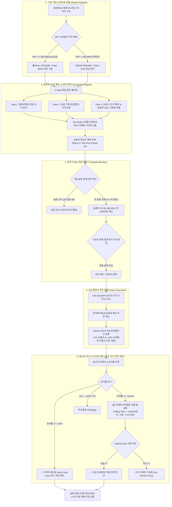

# 🏛️ 알상무 17년 퀀트 v2 자동매매 시스템 아키텍처 및 작동 로직 명세서

본 문서는 **알상무 17년 퀀트 프레임워크 v2(Goldman Sachs Quant 기반 듀얼 모멘텀 & 무제한 트레일링 익절 엔진)**의 엔드투엔드(End-to-End) 전자동 매매 작동 구조와 리스크 관리 체계를 설명합니다.

---

## 📊 1. 전체 작동 로직 다이어그램 (Operational Flowchart)

---

## 🔍 2. 5대 핵심 서브시스템 상세 명세

### [Phase 1] 시장 국면 & 매크로 판별 (Market Regime Engine)
* **판별 기준**: 미국 S&P 500 지수 추종 ETF(`SPY`)의 **200일 단순이동평균선(SMA 200)** 위치.
* **BULL REGIME (상승장)**:
  * 조건: `SPY 현재가 ≥ 200일선`
  * 운용: **3-Slot 100% 풀가동 모드** (계좌 자본 $7,500을 3개 슬롯에 33.3%씩 균등 배치).
* **BEAR REGIME (하락장)**:
  * 조건: `SPY 현재가 < 200일선`
  * 운용: **2-Slot + 50% 현금 대피 모드** (최대 2개 슬롯만 허용하며 최소 50%의 현금을 계좌에 강제 보존하여 MDD 방어).

---

### [Phase 2] 알상무 17년 퀀트 v2 분석 엔진 (Conviction Engine)
* **60개 정예 유니버스** 대상 3-Gate 퀀트 검증:
  1. **Gate 1 (일목 구름대)**: 선행스팬1 > 선행스팬2 (양운) 상단에 주가가 안착하여 하방 매물대 지지 형성.
  2. **Gate 2 (26일 기준선)**: 추세의 생명선인 26일 기준선 지지 후 양봉 반등 (이격도 -1.5% ~ +3.0%).
  3. **Gate 3 (20일 신고가 돌파 or VDU)**: 20일 신고가 돌파 모멘텀 또는 눌림목 구간에서 거래량 75% 이하 급감(VDU).
* **GS-Quant 3개월 상대강도(RS Momentum) 랭킹**:
  * 3개월 수익률 상위 주도주에 25% 가중치를 부여하여 최종 **Rank #1 Top Conviction 종목**과 **Rank #2 Runner-Up** 확정.

---

### [Phase 3] 동적 3-Slot 자본 배분기 (Capital Allocator)
* **계좌 기본 설정**: 총 자본금 1,000만원 ($7,500 USD @ 1,380원).
* **슬롯당 배분 한도**:
  * 상승장: 슬롯당 **$2,500 (33.3%)**
  * 하락장: 슬롯당 **$1,875 (25.0%)**
* **안전 가드레일**:
  * **기보유 종목 중복 매수 원천 차단** (동일 티커 중복 진입 불가).
  * 1주 미만 또는 슬롯 가용한도 초과 주문 사전 필터링.

---

### [Phase 4] 증권사 OpenAPI 주문 집행기 (Order Execution)
* **주문 방식**: 한국투자증권(KIS) 해외주식 실시간 OpenAPI를 통한 즉시 지정가/시장가 주문 전송.
* **체결 즉시 데이터 동기화**:
  * 체결 단가, 체결 수량, 체결 시간을 로컬 **SQLite SSOT(`my_portfolio`) 테이블**에 원자적(Atomic) 기록.
  * 진입과 동시에 **-4.0% 칼손절 트리거 가격**과 **+15.0% 1차 트레일링 익절 타겟 가격** 자동 세팅.

---

### [Phase 5] 실시간 포트폴리오 리스크 가디언 (Risk Guardian Daemon)
* **감시 주기**: 10초 간격 무한 백그라운드 루프.
* **1. 기계적 칼손절 (Hard Stop-Loss -4.0%)**:
  * 손실률이 `-4.0%`에 도달하면 감정이나 반등 기대 없이 **즉시 전량 시장가 매도** ➔ 하방 손실 확정 방어 (Convexity 확보).
* **2. 무제한 트레일링 익절 (Uncapped Trailing Stop)**:
  * 수익률이 `+15.0%`를 돌파하는 순간 **고점 추적 트레일링 모드 활성화**.
  * **실시간 익절 마지노선(Trailing Floor)** = `max(26일 기준선, 최근 최고가 - 2.5 × ATR(14))`.
  * 주가가 상승하는 한 익절선을 매일 끌어올리며 **추세를 끝까지 홀딩(Let Winners Run)**하다가, 익절선을 이탈하는 순간 전량 이익 실현.

---

## 👤 3. 운용자(사용자) 가이드 및 수동 개입 원칙

1. **평상시 (Zero-Touch 운용)**:
   * 사용자는 `알상무_퀀트_터미널_실행.bat`을 실행해 두기만 하면 되며, 수동으로 매매 버튼을 누를 필요가 없습니다.
2. **수동 콘솔(Manual Console)의 존재 이유**:
   * **비상 킬 스위치 (Emergency Override)**: 지정학적 이벤트 등 긴급 상황 시 즉각 전량 청산.
   * **재량 매매 (Discretionary)**: 사용자가 발굴한 개별 종목을 가용 슬롯에 직접 진입 테스트.
